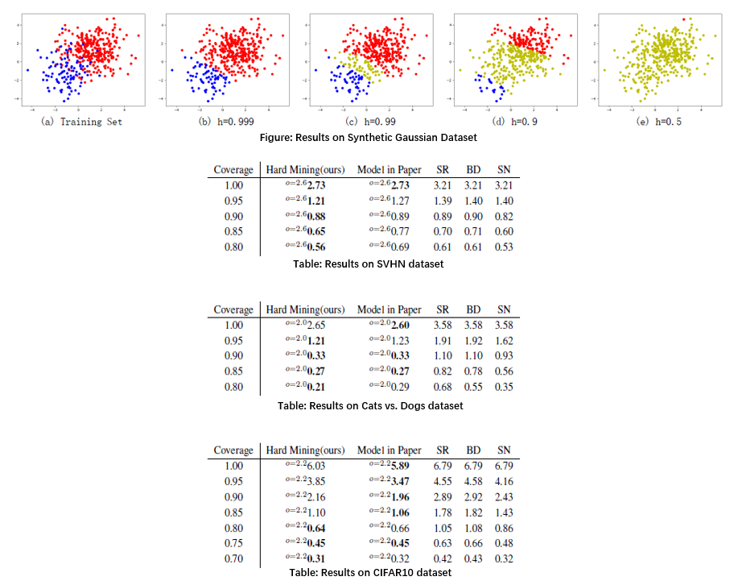

# DeepGamblers.pytorch

This repository is an unofficial pytorch implementation of 
[Deep Gamblers: Learning to Abstain with Portfolio Theory](https://arxiv.org/abs/1907.00208).
We reimplement the experiments in the paper, and the detailed understanding is available on my [Blog](https://www.cnblogs.com/CZiFan/p/12676577.html).

## Requirements
- Pytorch>=0.4.0
- CPU or GPU
- Other packages can be installed with the following instruction:
```
pip install requirements.txt
```
  
## Quick start
Running the code with the following command.
```
python main.py
```
Note: You can modify some parameters in "configs/config.py" to get your own specific models.

## Results

## Citation
```
@article{ZiyinDeep,
  title={Deep Gamblers: Learning to Abstain with Portfolio Theory},
  author={Ziyin, Liu and Wang, Zhikang and Liang, Paul Pu and Salakhutdinov, Ruslan and Morency, Louis-Philippe and Ueda, Masahito},
}
```